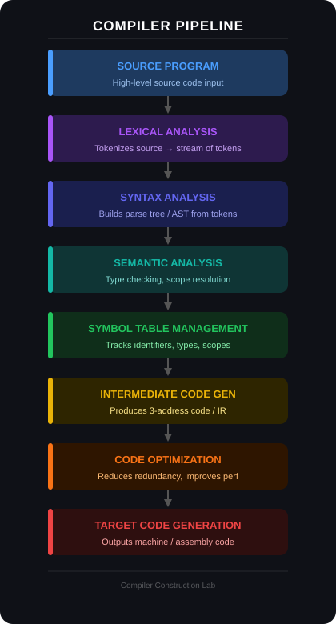

## Overview

This repository contains the implementation of a **mini compiler** developed as part of the Compiler Construction Lab. The project demonstrates the classical phases of compilation and builds a complete pipeline that translates a source program into target code.

The compiler is implemented incrementally, with each stage building upon the previous one to form a full compilation workflow.

---

## Compiler Pipeline

The compiler processes a source program through the following stages:

 

Each stage contributes to transforming high-level source code into a lower-level representation suitable for execution.

---

## Features

This compiler includes implementations of the following components:

- **Lexical Analyzer** for tokenizing source code
- **Parser** for validating grammar and building parse structures
- **Semantic Analyzer** for type checking and semantic validation
- **Symbol Table** for managing identifiers and scope
- **Intermediate Code Generator**
- **Basic Code Optimization**
- **Target Code Generation**

---

## Repository Structure

```
mini-compiler
│
├── lexer
│
├── parser
│
├── semantic-analysis
│
├── intermediate-code
│
├── optimization
│
├── target-code
│
└── test-programs
```

Each module corresponds to a stage in the compiler pipeline.

---

## Status

🚧 **Work in progress**: components are being implemented incrementally as part of the compiler development process.
